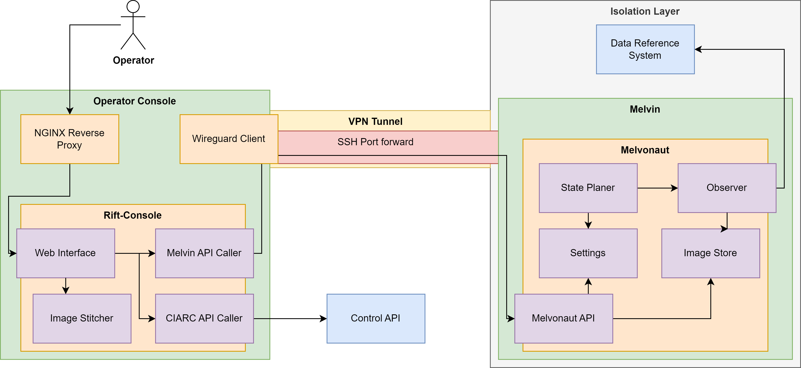

# CIARC - Riftonauts

[](https://c103-219.cloud.gwdg.de/)
[](https://lolsayna.github.io/CIARC/)


## Overview

This is the [Riftonaut's CIARC](https://github.com/Lolsayna/CIARC) repository.
It implements software for MELVIN and the Operator Console for the
ESA [Computer In A Room Challenge 3](https://www.esa.int/Education/Engagement/Applications_are_now_open_for_the_ESA_Academy_s_Computer_In_A_Room_Challenge_CIARC_3).

The project implements two packages: `melvonaut` and `rift-console`.

The Operator Console, referred to as _Rift-Console_, implements a web application based on Quart,
which provides an interface to visualize and control MELVIN in the satellite simulation.
Moreover, it implements background tasks to analyse data from MELVIN and complete given objectives.

The driver software for MELVIN, referred to as _Melvonaut_, implements an async Python service,
which continuously operates MELVIN towards the completion of its tasks.
Moreover, it provides endpoints to retrieve the collected data to the Rift-Console in the limited communication windows.

## Requirements

Melvonaut requires Python 3.12 and expects a live connection to the CIARC API.

Rift-Console requires Docker and Docker Compose.
It is recommended to also provide a public domain name to run the application via TLS. A local development version of Rift-Console also exists without docker.

## Installation

### Melvonaut

For deployment of Melvonaut on Melvin, Python 3.12 is required.
In order to provide an isolated installation that persists across reboots, we compile Python 3.12 in user space.

<details>
    <summary>SSH into Melvin and execute the following commands</summary>

```shell
cd /home

apt update
apt install git nano

# Install Python 3.12 build dependencies
apt -y install build-essential zlib1g-dev libncurses5-dev libgdbm-dev libnss3-dev libssl-dev libreadline-dev libffi-dev libsqlite3-dev wget libbz2-dev

# Get and build Python 3.12.9, newest 3.12 at the time of writing
wget https://www.python.org/ftp/python/3.12.9/Python-3.12.9.tgz
tar xzf Python-3.12.9.tgz
rm Python-3.12.9.tgz
cd Python-3.12.9
./configure --enable-optimizations

# This takes some time
make -j 16

# Verify that it worked
./python --version

# Install Melvonaut
cd /home
git clone https://github.com/LolSayna/CIARC
cd CIARC
../Python-3.12.9/python -m venv venv
source venv/bin/activate
pip install poetry
poetry install --with melvonaut

# Optional, reset the container to remove the build dependencies
kill 1

# Run Melvonaut with
./start-melvonaut.sh
# To let it run in the background use
./start-melvonaut.sh & disown

# To follow the logs
cd /home/CIARC/logs/melvonaut
# Replace yyyy-mm-dd-hh with the current date or look for the newest file
tail -f log_melvonaut_yyyy-mm-dd-hh.log

# To stop Melvonaut restart the container
kill 1

# To update
git pull

# To be able to update after restarting the container, git must be reinstalled
apt update
apt install git
```
</details>

Melvonaut supports sending error messages via Discord while network simulation is deactivated
or during communication windows.
To use this, a Discord webhook must be set via the environment variable `DISCORD_WEBHOOK_TOKEN`.
This can be done by copying the `.env.example` file to `.env` and inserting the token retrieved from Discord.
Also `DISCORD_ALERTS_ENABLED` must be set to True in the `.env` file.

### Rift-Console

Rift-Console is intended to be deployed via docker-compose on a node
running a wire-guard connection to MELVIN and the CIARC API.

Ensure that docker and docker-compose are installed.
Rift-console is intended to be deployed on a public domain.
If available edit `nginx.conf` to add the public domain under `map "" $domain` and the IP of the host under `map "" $host_ip`.

To run the application via TLS, lets encrypt may be used.
Edit the file `letsencrypt-config.sh` and add your domain and IP address.
It is recommended to test with the staging environment active first.
Then run `./init-letsencrypt.sh` to generate the initial certificates.
The host must be publicly reachable on port 80 and 443.

Rift-console is protected via HTTP Basic Authentication.
Valid username and password pairs are read from `.http-pass`.
Install `htpasswd` via the respective package, e.g., `apt install apache2-utils`.
Run `htpasswd .http-pass username` to create a new user.
You will be prompted for a password.

To deploy the Rift-Console using docker-compose, run `make docker-compose-up`.
This builds the image and starts the containers.
Follow the logs with `docker-compose logs -f`.
To stop the containers run `docker-compose down`.

If no public domain is available, Rift-Console can also be run locally.
Run `docker-compose up --build -d rift-console` to start the container.
Rift-Console is available at `http://localhost:3000/`

The docker-compose setup also includes mkdocs.
The docs can be found at `https://<your-domain>/docs`.

Rift-Console uses an API exposed by Melvonaut to retrieve data and send control commands.
For this Rift-Console expects the Melvonaut API to be reachable at http://localhost:8080/.
When not running Melvonaut locally, port forwarding should be used.
A script for this is provided in the `ssh-scripts` directory as `ssh-forward-melvonaut-api.sh`.
The script requires a file `.ssh-pw` containing the password for the ssh connection and sshpass to be installed or can be modifyed to use an ssh-key.

## Usage

### Melvonaut
Run `poetry run melvonaut` to start the service.
Run `poetry run  melvonaut --help` for more information.

For production deployment use the `start-melvonaut.sh` script.
This includes automatic restarts on crashes.

To remotely control Melvonaut, additional scripts are provided in `ssh-scripts`.


### Rift-Console
Run `poetry run rift-console run-server` to start the service locally.
Rift-Console can then be controlled from the web interface at http://localhost:3000.

## Development

The implementation uses Python 3.12 and [Poetry](https://python-poetry.org/).

The easiest way to set up Poetry is to install [pipx](https://pipx.pypa.io/) and then to run
```bash
pipx install poetry
```
It is assumed that Python 3.12 is available on the system.

### Installation

To install Melvonaut and Rift-Console with all dependencies, run the following commands
```bash
# Prepare the virtual environment
poetry config virtualenvs.in-project true
poetry env use python3.12
poetry install --all-groups

# Then activate the virtual environment via
source $(poetry env info --path)/bin/activate
# or
source .venv/bin/activate
```

This installs the Melvonaut, Rift-Console and development dependencies
and allows running Melvonaut and Rift-Console locally via
`melvonaut` and `rift-console`, respectively.

### Architecture



The diagram above shows the architecture of Melvonaut and Rift-Console in the context of CIARC.
On the left side is the Operator Console, which runs on a VM with the Rift-Console and an NGINX Reverse Proxy are deployed as containers.
NGINX exposes access to web interface of the Rift-Console via a public domain, using HTTP authentication to secure the access.

The Rift-Console consists of a web interface, which enables controlling Melvonaut as well as the simulation.
To control the simulation, the Rift-Console is able to send requests to the simulation control API.
For controlling Melvonaut, the Rift-Console connects to an API provided by Melvonaut.
The Melvonaut API is only reachable during communication windows via an SSH tunnel to Melvin.
Besides performing control operations, the Melvonaut API also allows for downloading files such as logs and images.
Moreover, the Rift-Console also implements an image stitching system to assemble pictures for objectives and the world map.

The Operator Console VM also runs a WireGuard client to connect to the isolation layer, .i.e., the internal network of Melvin and the data reference system.
On Melvin runs Melvonaut as a Python program.
Melvonaut is managed by the state planer, which determines when to switch tasks.
The Melvin API caller connects to the data reference system to collect telemetry data, request images and trigger state changes and other control operations.
The current state is refreshed multiple times per second such that the state planer can wait for certain conditions to activate components and trigger state changes based on the current task.
For example, when the state planer detects that the current battery level is below a certain threshold, it will trigger a switch to charge mode.
The conditions and activations the state planer performs are based on the settings, which can be updated through the Melvonaut API from the Rift-Console.

### Code Structure

<details>
    <summary>Folders & Files</summary>

```
├── data                                              # NGINX and Certbot data
├── docker-compose.yml
├── Dockerfile                                        # Rift-Console Dockerfile
├── Dockerfile.mkdocs                                 # Mkdocs Dockerfile
├── docs                                              # Project docs
├── init-letsencrypt.sh
├── letsencrypt-config.sh
├── LICENSE
├── logs
│     ├── melvonaut
│     │     ├── event_melvonaut.csv                   # Announcements captured form stream
│     │     ├── images                                # Saved images
│     │     └── log_melvonaut_XXXX.log                # Python logging
│     │     └── telemetry_melvonaut.csv               # Telemetry
│     │     └── persistent_settings.json              # Settings that override defaults
│     └── rift_console
│         ├── from_melvonaut                          # Logs/Events/Telemetry downloaded from Melvonaut
│         └── images                                  # Downloaded/Stitched/Processed images
├── Makefile
├── media                                             # Static files for docs
├── mkdocs.yml
├── nginx.conf
├── poetry.lock
├── pyproject.toml
├── README.md
├── src
│     ├── melvonaut
│     │     ├── __init__.py
│     │     ├── __main__.py                           # Main control flow
│     │     ├── api.py                                # Melvonaut API, consumed by Rift-Console
│     │     ├── ebt_calc.py                           # Beacon calculator
│     │     ├── mel_telemetry.py                      # Telemtry data class
│     │     ├── settings.py                           # Melvonaut settings
│     │     ├── state_planer.py                       # State management logic
│     │     └── utils.py                              # Helper functions
│     ├── rift_console
│     │     ├── __init__.py
│     │     ├── __main__.py                           # Quart routes + logic
│     │     ├── rift_console.py                       # Dataclass
│     │     ├── ciarc_api.py                          # Connection to CIARC API
│     │     ├── melvin_api.py                         # Connection to Melvonaut API
│     │     ├── image_processing.py                   # Image stitching
│     │     ├── image_helper.py
│     │     ├── static
│     │     │     ├── images
│     │     │     └── satellite.svg
│     │     └── templates
│     │         ├── main.html                         # Index page
│     │         ├── live.html
│     │         ├── downloads.html
│     │         └── stitched.html
│     │         ├── ebt.html
│     └── shared
│         ├── __init__.py
│         ├── constants.py                            # Shared constants
│         ├── models.py                               # Shared data classes
├── ssh-scripts
│     ├── ssh-forward-melvonaut-api.sh                # Port forward Melvonaut API to localhost
│     ├── ssh-git-pull-on-melvin.sh                   # Update CIARC on Melvin
│     ├── ssh-restart-melvin-container.sh             # Kill the Melvin container
│     ├── ssh-restart-melvonaut.sh                    # Stop Melvonaut and let wrapper restart it
│     ├── ssh-start-melvonaut.sh                      # Run wrapper start script
│     └── ssh-stop-melvonaut.sh                       # Stop Melvonaut and wrapper script
├── start-melvonaut.sh                                # Wrapper script for restarting Melvonaut
└── tests
    ├── test_melvonaut
    │     ├── __init__.py
    │     ├── conftest.py
    │     ├── test_api.py
    │     ├── test_main.py
    │     ├── test_models.py
    │     ├── test_settings.py
    │     └── test_state_planer.py
    └── test_rift_console
        ├── __init__.py
        └── test_main.py
```
</details>

### Testing

Melvonaut is tested using [pytest](https://docs.pytest.org/en/latest/).
Tests can be run via `make test`.
To run with coverage, run `make coverage`.
The tests are also run via Github Actions.

### Type Checking and Linting
Use `make mypy` and `make lint` inside an active poetry enviroment.

## License

Distributed under the terms of the [MIT license][license],
_Ciarc_ is free and open source software.


[license]: https://github.com/Lolsayna/CIARC/blob/main/LICENSE
